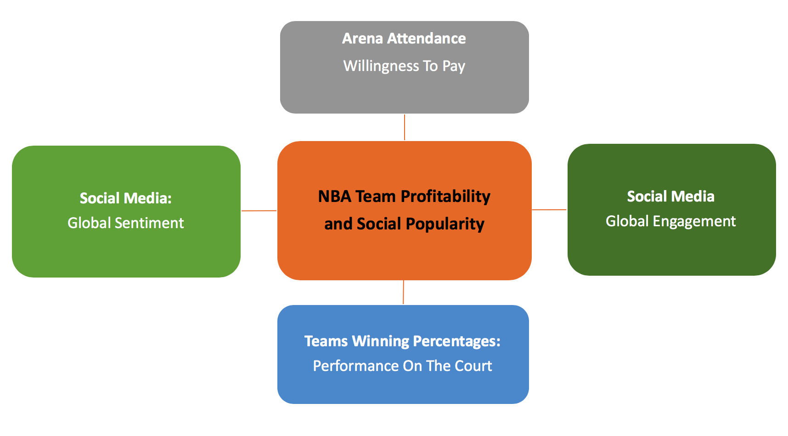
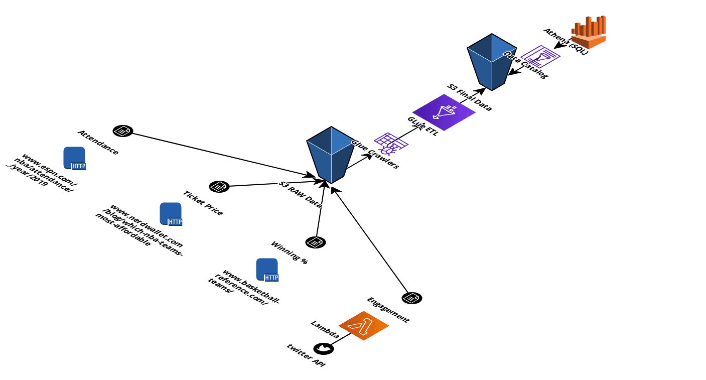

# Pictet Case Study: Does the popularity of a NBA team correlate with its profitability?

## 1) Problem Definition
It is obvious that professional sports in the United States, as in several other countries, are profit driven institutions in an intensely competitive entertainment industry.
As profit-driven entities, sport franchises strive to increase revenues from various
sources, primarily ticket sales and television contracts. NBA teams aim to achieve such a performance level.

Based on a study  called "Poor performance Benchmarking: An International Journal" [reference = Vol. 13 No. 3, 2006 pp. 252-271 Emerald Group Publishing Limited], it is estimated to have cost NBA teams $5.3-7.8 million a year, in ticket sales alone, depending on ticket prices and the actual capacity. Such large
incremental revenue, for operations with a predominantly fixed cost structure, can
make a significant difference in profits.

## 2) Goal

Hence, NBA teams are eager to find which channels of communications can influence their profits by dragging more fans to their stadiums, potential television or radio contract revenues, or any other related business revenues.

Therefore, to conduct a quantitative analysis, I will acquire data from various sources, structure and consolidate them to build indicators for the popularity and profitability of NBA teams:
- use the engagement of a team on twitter as an indicator of its popularity
- use the sales of a team’s tickets as a basic proxy to its profitability
- Also use additional data to enhance the analysis as winning percentages

## 3) Abstract
This case study examined the effects of engagement with NBA teams’ Twitter pages on attendance, operating income, and twitter favorite / retweets number. Total number of tweets, likes, retweets, and user followers were
calculated for each NBA team.
Regression equations were run to analyze how the number of tweet likes and winning percentages with profitability income. Results indicated the average number of tweets likes had significantly correlate with 
profitability incomes.

## 4) Data Sources

- Social Media (twitter and wikipedia):
    - Engagement of the teams
    - Sentiment analysis in real time
    
- NBA Attendance:
    - http://www.espn.com/nba/attendance/_/year/2019
    
- NBA Ticket Price:
    - https://www.nerdwallet.com/blog/which-nba-teams-most-affordable/#cleveland
    - https://www.vividseats.com/nba-basketball/denver-nuggets-tickets/nuggets-3-18-3215516.html
    - https://finance.yahoo.com/news/average-ticket-prices-nba-team-100000563.html
    - https://teammarketing.com/fci/2017-nfl-fan-cost-index/
    - https://blog.barrystickets.com/nba-ticket-prices/
    
- NBA Teams Winning Percentages:
    - https://www.basketball-reference.com/teams/

## 5) High level steps
- 1) Raw data acquisition from various sources.
- 2) Aggregating, structuring and building datasets 
- 3) Designing, deploying and maintaining the full data processing pipeline


# Getting Started

These instructions will help you running this project on your local machine. After installing the prerequisites, follow the steps from the [jupyter notebook](https://github.com/mehdimansouri/pictet/blob/master/Popularity%20of%20NBA%20teams.ipynb).

## 1) Prerequisites

The Python framework used for this project is "Anaconda 3". 
```
wget https://repo.anaconda.com/archive/Anaconda3-2020.02-MacOSX-x86_64.sh
bash ~/Downloads/Anaconda3-2020.02-MacOSX-x86_64.sh
```
The following python libraries are required:
- pandas
- numpay
- scrapy
- matplotlib
- seaborn
- 

## 2) Built With

* [python 3.7](https://www.anaconda.com/distribution/) - The web framework used Anaconda 3
* [AWS](https://aws.amazon.com/) - S3, Lambda, Glue, Athena, quicksight -  for Data Pipeline Automation
* [Cloudcraft](https://app.cloudcraft.co/) - Data Pipeline Design

## 3) Authors

* **Mehdi Mansouri**

## 4) License

This project is licensed under the MIT License - see the [LICENSE.md](LICENSE.md) file for details

