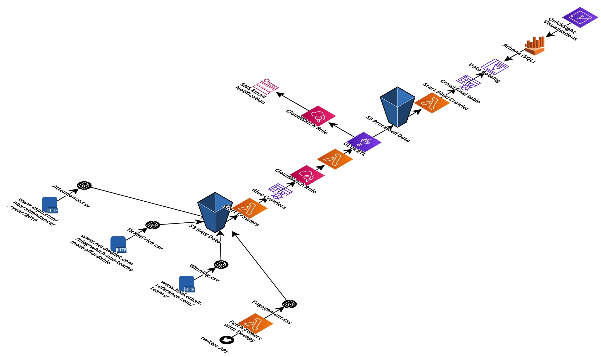
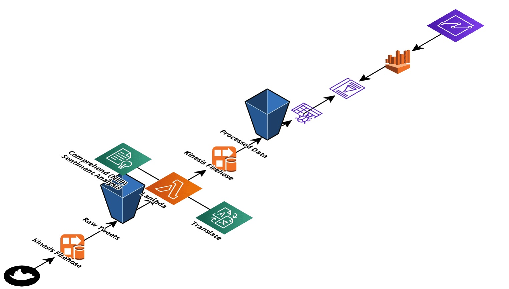

# Pictet Case Study: Does the popularity of a NBA team correlate with its profitability?

## 1) Problem Definition

The National Basketball Association (NBA) is a men's professional basketball league in North
America; composed of 30 teams (29 in the United States and 1 in Canada).

The NBA is a collection of 30 teams, broken down by two conferences with three divisions apiece. The Western Conference plays host to the Northwest, Pacific and Southwest Divisions, featuring the following 15 teams:

> Northwest: Denver Nuggets, Minnesota Timberwolves, Oklahoma City Thunder, Portland Trail Blazers, Utah Jazz

> Pacific: Golden State Warriors, Los Angeles Clippers, Los Angeles Lakers, Phoenix Suns, Sacramento Kings

> Southwest: Dallas Mavericks, Houston Rockets, Memphis Grizzlies, New Orleans Pelicans, San Antonio Spurs

The Eastern Conference's 15 squads also break up across three divisions: the Atlantic, Southeast and Central.

> Atlantic: Boston Celtics, Brooklyn Nets, New York Knicks, Philadelphia 76ers, Toronto Raptors

> Central: Chicago Bulls, Cleveland Cavaliers, Detroit Pistons, Indiana Pacers, Milwaukee Bucks

> Southeast: Atlanta Hawks, Charlotte Hornets, Miami Heat, Orlando Magic, Washington Wizards


Over the years, NBA has become increasingly popular internationally. According to a Twitter study, NBA was the most
discussed sports league in 2018.
We are interested in the following question:
- <b> Does the popularity of a NBA team correlate with its profitability?<b>

It is obvious that professional sports in the United States, as in several other countries, are profit driven institutions in an intensely competitive entertainment industry.
As profit-driven entities, sport franchises strive to increase revenues from various
sources, primarily ticket sales and television contracts. NBA teams aim to achieve such a performance level.

Based on a study named "Poor performance Benchmarking: An International Journal" [reference = Vol. 13 No. 3, 2006 pp. 252-271 Emerald Group Publishing Limited], the estimated to have cost NBA teams $5.3-7.8 million a year, in ticket sales alone, depending on ticket prices and the actual capacity. Such large
incremental revenue, for operations with a predominantly fixed cost structure, can
make a significant difference in profits.

## 2) Goal

As NBA teams are eager to identify new indicators that influences positivaly their profitability, the goal of this case study, as Lead Data Engineer, is to help the Data Science team to find those new indicators by conducting a qunatitative analysis. I will retrieve data from various sources, structure and consolidate them to build indicators for the popularity and profitability of NBA teams, so the Data Scientist team can continue further analysis and take final decision.
The Data Scope for this case study will be as following:
- use the engagement of a team on twitter as an indicator of its popularity
- use the sales of a team’s tickets as a basic proxy to its profitability
- Also use additional data to enhance the analysis as winning percentages
## 3) Abstract
This case study examined the relationship of engagement of NBA teams in their twitter pages in terms of number of favorite and retweets with their profitability in terms of stadium attendance, ticket price and winning percentages. Correlation matrix and Regression equations were run to analyze the relationship between different indicators collected and enriched. Results indicated the average number of tweets likes had significantly correlate with profitability incomes.

## 4) Data Sources

- Social Media (twitter and wikipedia):
    - Engagement of the teams: retrieve historical data using twitter API
    - Sentiment analysis in real time: AWS end to end solution described in [CloudFormation](src/aws/twitter_real_time_streaming_cloudformation.yaml)
    
- NBA Attendance:
    - http://www.espn.com/nba/attendance/_/year/2019
    
- NBA Ticket Price:
    - https://www.nerdwallet.com/blog/which-nba-teams-most-affordable/#cleveland
    - https://www.vividseats.com/nba-basketball/denver-nuggets-tickets/nuggets-3-18-3215516.html
    - https://finance.yahoo.com/news/average-ticket-prices-nba-team-100000563.html
    - https://teammarketing.com/fci/2017-nfl-fan-cost-index/
    - https://blog.barrystickets.com/nba-ticket-prices/
    
- NBA Teams Winning Percentages:
    - https://www.basketball-reference.com/teams/

## 5) High level steps
- 1) Raw data acquisition from various sources.
- 2) Aggregating, structuring and building datasets 
- 3) Designing, deploying and maintaining the full data processing pipeline

- 4) Twitter real time streaming pipeline


# Getting Started

These instructions will help you running this project on your local machine. After installing the prerequisites, follow the steps from the [jupyter notebook](Popularity%20of%20NBA%20teams.ipynb).

## 1) Prerequisites

The Python framework used for this project is "Anaconda 3". 
```
wget https://repo.anaconda.com/archive/Anaconda3-2020.02-MacOSX-x86_64.sh
bash ~/Downloads/Anaconda3-2020.02-MacOSX-x86_64.sh
```
The requirement list of python libraries are:
- pandas
- numpay
- scrapy
- matplotlib
- seaborn
- tweepy
- imageio
- wordcloud
- statsmodels

## 2) Built With

* [python 3.7](https://www.anaconda.com/distribution/) - The web framework used Anaconda 3
* [AWS](https://aws.amazon.com/) - S3, Lambda, Glue, Athena, quicksight -  for Data Pipeline Automation
* [Cloudcraft](https://app.cloudcraft.co/) - Data Pipeline Design

## 3) Authors

* **Mehdi Mansouri**

## 4) License

This project is licensed under the MIT License - see the [LICENSE.md](LICENSE.md) file for details

